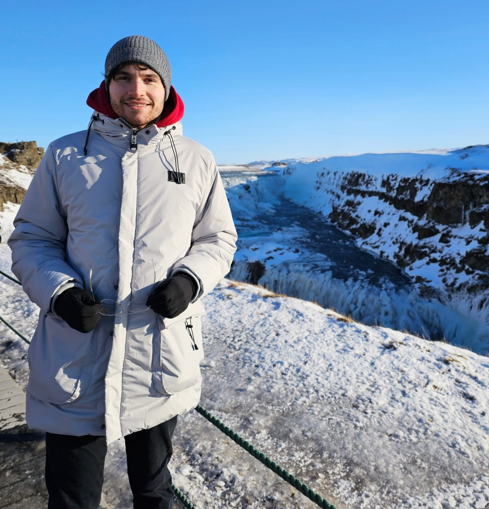

Hey there ! I am Adrian Joshua Strutt (25).
Currently, I am completing my M.Sc. Computer Science specialized in AI, finishing in November.

I started coding roughly 15 years ago. Starting with (Visual) Basic, I quickly switched to C#.
Using WPF I coded several smaller projects, such as games in the Unity Engine and networking tools.
I finished my Abitur in 2017, with my major area of study being computer science and english.
Through several university projects, I have gained deep insights into Python, PyTorch, computer
vision, and Generative AI. At the moment, I'm working on my master's thesis focused on self-supervised learning.

Most of my private and university projects will be uploaded to this page.
Feel free to also look at [my GitHub Page](https://github.com/adrianjoshua-strutt).

## What I work with

(This site is hosted using GitHub Actions and Jekyll)